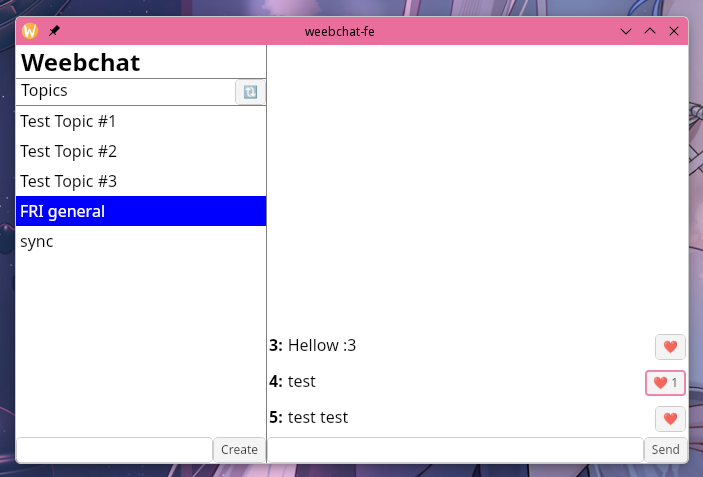

# weebchat (klepetalnica)

## Starting the server nodes

```bash
# Start the control plane node
go run main.go control -sMySecretKey

# Add data plane nodes
go run main.go data -sMySecretKey -alocalhost:7001
go run main.go data -sMySecretKey -alocalhost:7002
go run main.go data -sMySecretKey -alocalhost:7003
go run main.go data -sMySecretKey -alocalhost:7004
# ...
```

## Client (wails app)

[Install / setup wails](https://wails.io/docs/gettingstarted/installation)

```bash
cd weebchat-ui

wails doctor # check if everything is ok

wails dev # start the app in dev mode
```

